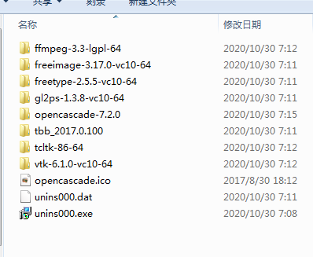
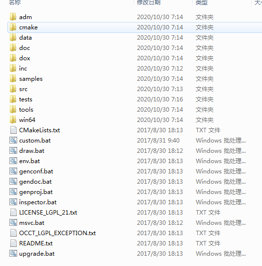
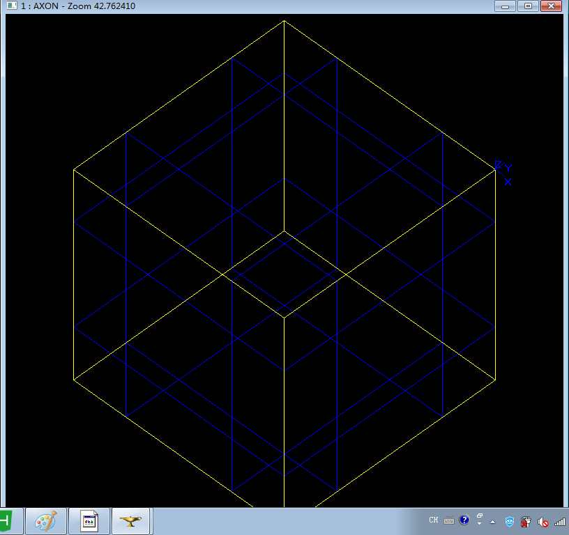

#OCCT学习002-----环境搭建
# OCCT安装与测试
**longlongway2012@hotmail.com**
## 一、前言
occ作为开源软件，可以通过官网注册下载，也可以从网上搜索别人的分享连接来获得。[官网occ7.5下载地址](https://old.opencascade.com/content/latest-release)。最新版增加了很多新的特性，同时需要vs2017支持。本人受机器空间限制，使用vs2010作为学习环境，因此使用opencascade-7.2.0-vc10-64.exe版本作为基础学习。

## 二、occ安装过程
运行安装程序，可以选择全部安装或自定义安装，自定安装可以只选择需要的组件进行安装。安装完后，源码根目录如下：

以上目录包含第三方库依赖和occ目录，进入occ目录：
	以上目录介绍如下：
	
- adm目录：包含编译OCCT的相关工程;
	- adm/cmake目录：包含使用CMake构建OCCT的相关处理脚本;
	- adm/msvc目录：包含window平台 Visual C++ 2010, 2012, 2013, 2015, 2017 and 2019等版本的32/64平台solutinon文件;
- data目录： 包含用于OCCT功能测试的CAD文件
- doc目录：包含OCCT的html和pdf格式帮助文档;
- dox目录：包含了基于MarkDown文件格式的文本文档;
- inc目录：OCCT头文件依赖;
- samples目录：OCCT示例项目;
- src目录：OCCT源码目录;
- tests目录：包含测试脚本文件
- tools目录：包含Inspector工具的源码.
- win64/vc10目录：包含window平台预编译的可执行程序和lib库;
- gendoc.bat： 将occt的Markdown格式文件编译为html格式
- inspector.bat occinspector工具运行环境
- msvc.bat： visual studio编译工程和运行环境
- draw.bat: draw工具运行环境
# 三、测试	
安装后首次可以使用draw.bat 执行测试OCCT：

	- 运行draw.bat
	- 输入命令：pload DEFAULT
	- 输入命令：axo，显示三维辅助视图，出现三维坐标架
	- 输入命令创建立方体：box b -10 -10 -10 10 10 10 ，显示一个小立方体网格
	- 输入命令 fit，调整最佳观察位置

# 四、其他参考
 网上有很多人写的也人详细，附在此处仅用参考：
 - [官网Install说明](https://old.opencascade.com/doc/occt-7.4.0/overview/html/index.html#OCCT_OVW_SECTION_4)
 - [OpenCasCade开发环境搭建](http://www.zyh1690.org/opencascade-development-environment-set-up/)
 - [OpenCASCADE(一) VS2017+OpenCASCADE+MFC +win10下载配置安装运行单文档程序画个基本图形](https://www.cnblogs.com/DOMLX/p/12368154.html)