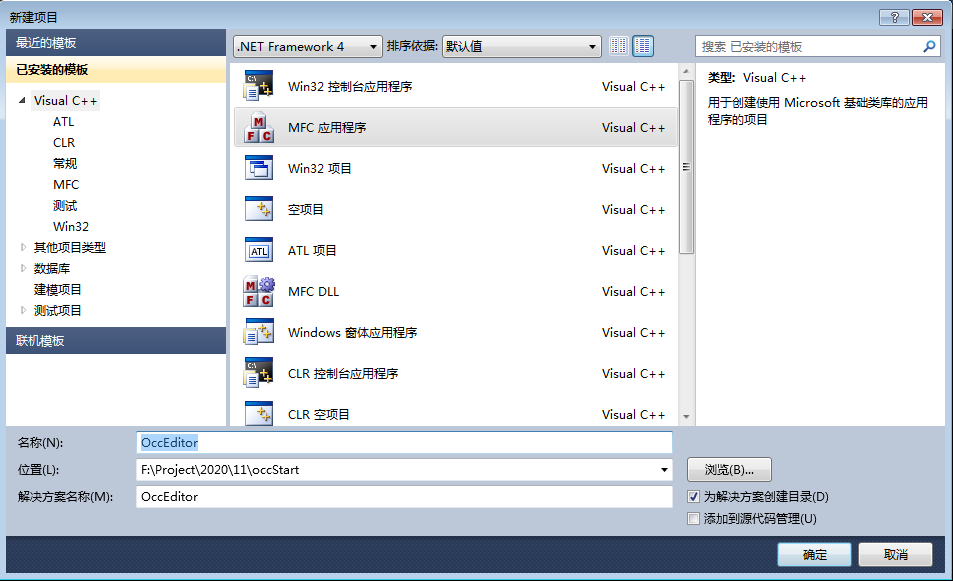
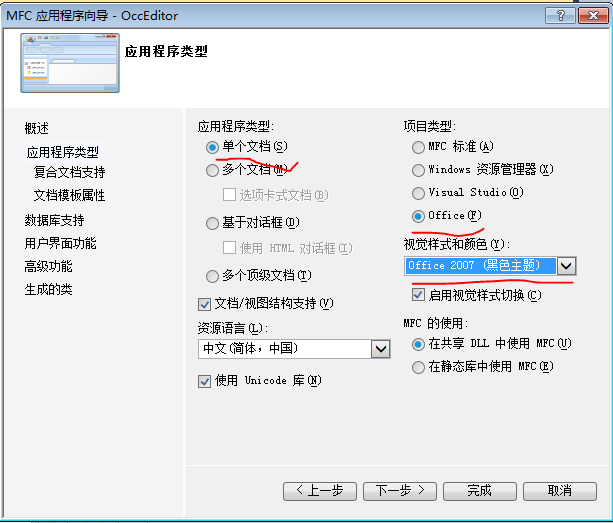
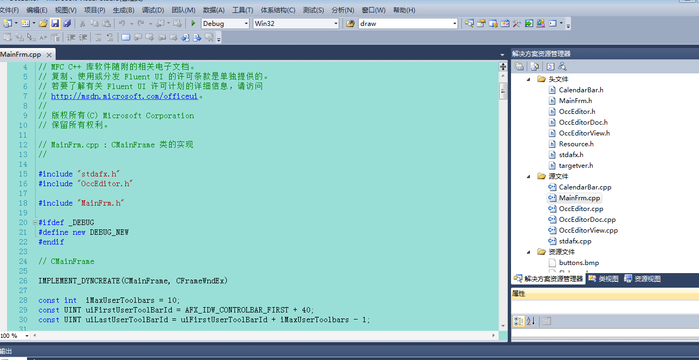
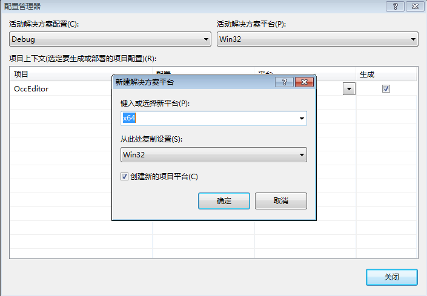
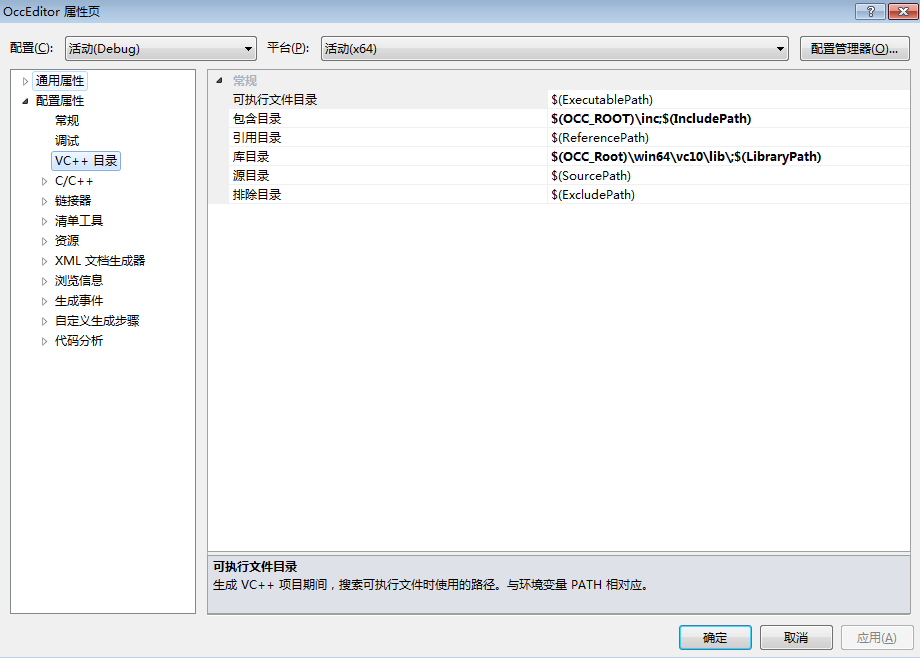
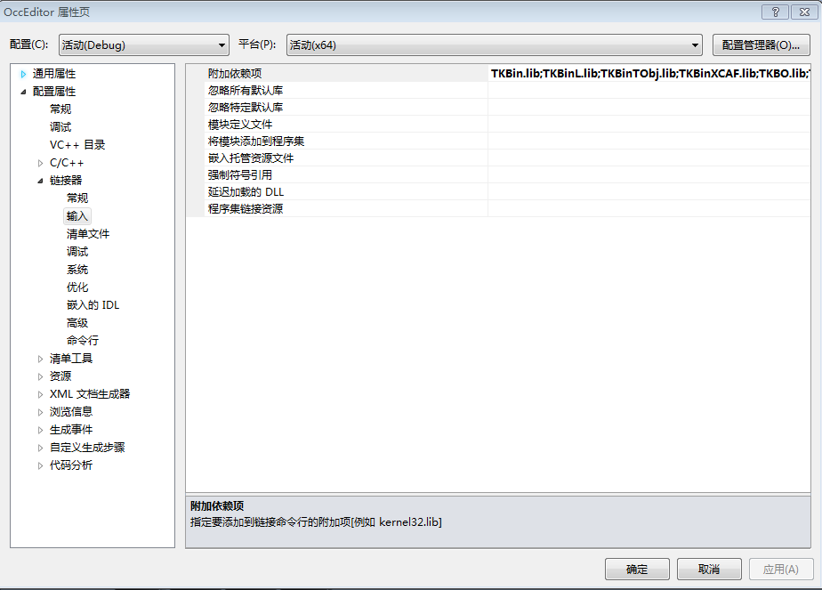
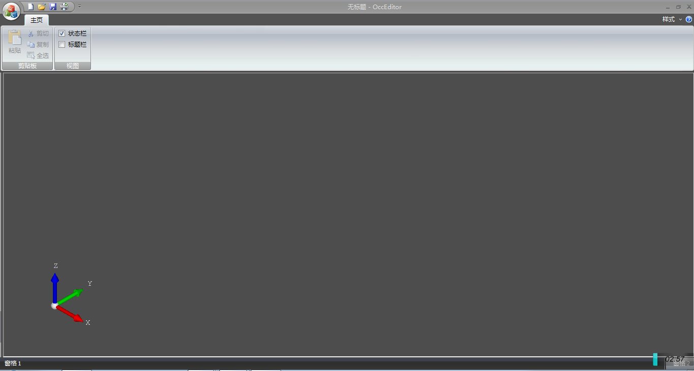
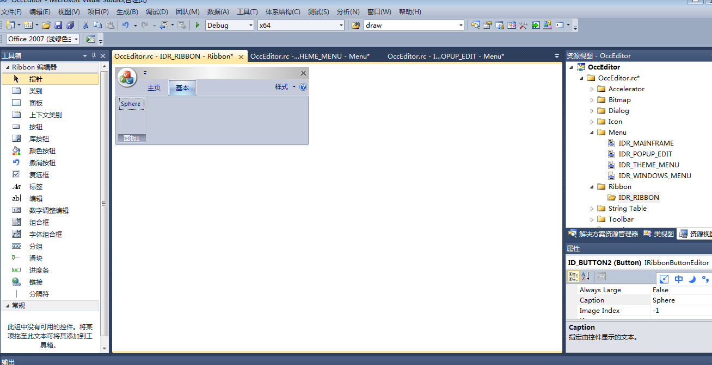
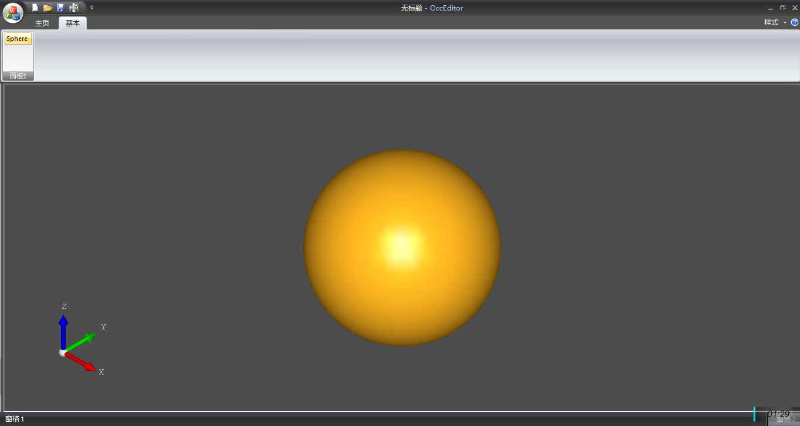

# OCCT学习003-----MFC单文档工程创建
**longlongway2012@hotmail.com**
# 背景
	window平台下开发软件，常用的c++界面开发主要使用MFC，虽然近些年几乎被淘汰，但对于传统软件公司，仍然没有抛弃掉。后起之秀Qt也很受欢迎，以后再研究，这里先从MFC开个头。

# 开发准备
 - vs2010开发环境
 - occt 7.2版本
 最新的vs已经到了2019，下一个版本估计是2021了，但对于研究机制，差别不是很大，其他人可以进行尝试。
 
# 创建工程和环境配置
 创建MFC单文档工程和运行环境

- 设置工程名称：
	
	
- 设置工程界面风格
	
	
- 最终点击完成，生成了一个空的MFC单文档框架程序：
	
	
- 创建x64程序
	
	
- 设置库路径
	
	
- 填写依赖库：
	
	
		TKBin.lib;TKBinL.lib;TKBinTObj.lib;TKBinXCAF.lib;TKBO.lib;TKBool.lib;TKBRep.lib;TKCAF.lib;TKCDF.lib;TKD3DHost.lib;TKDCAF.lib;TKDFBrowser.lib;TKDraw.lib;TKernel.lib;TKFeat.lib;TKFillet.lib;TKG2d.lib;TKG3d.lib;TKGeomAlgo.lib;TKGeomBase.lib;TKHLR.lib;TKIGES.lib;TKIVtk.lib;TKIVtkDraw.lib;TKLCAF.lib;TKMath.lib;TKMesh.lib;TKMeshVS.lib;TKOffset.lib;TKOpenGl.lib;TKPrim.lib;TKQADraw.lib;TKService.lib;TKShapeView.lib;TKShHealing.lib;TKStd.lib;TKStdL.lib;TKSTEP.lib;TKSTEP209.lib;TKSTEPAttr.lib;TKSTEPBase.lib;TKSTL.lib;TKTInspector.lib;TKTInspectorAPI.lib;TKTObj.lib;TKTObjDRAW.lib;TKToolsDraw.lib;TKTopAlgo.lib;TKTopTest.lib;TKTreeModel.lib;TKV3d.lib;TKVCAF.lib;TKView.lib;TKViewerTest.lib;TKVInspector.lib;TKVRML.lib;TKXCAF.lib;TKXDEDRAW.lib;TKXDEIGES.lib;TKXDESTEP.lib;TKXMesh.lib;TKXml.lib;TKXmlL.lib;TKXmlTObj.lib;TKXmlXCAF.lib;TKXSBase.lib;TKXSDRAW.lib
		
- 创建occ运行的运行环境env.bat，可以参考occ中的custom.bat和evironment.bat
 
		set OCC_ROOT=F:\Project\occ\OpenCASCADE-7.2.0-vc10-64\opencascade-7.2.0
		set path=%path%;F:\Project\occ\OpenCASCADE-7.2.0-vc10-64\opencascade-7.2.0\win64\vc10\bin;F:\Project\occ\OpenCASCADE-7.2.0-vc10-64\ffmpeg-3.3-lgpl-64\bin;F:\Project\occ\OpenCASCADE-7.2.0-vc10-64\freeimage-3.17.0-vc10-64\bin;F:\Project\occ\OpenCASCADE-7.2.0-vc10-64\freetype-2.5.5-vc10-64\bin;F:\Project\occ\OpenCASCADE-7.2.0-vc10-64\gl2ps-1.3.8-vc10-64\bin;F:\Project\occ\OpenCASCADE-7.2.0-vc10-64\tbb_2017.0.100\bin\intel64\vc10;F:\Project\occ\OpenCASCADE-7.2.0-vc10-64\tcltk-86-64\bin;F:\Project\occ\OpenCASCADE-7.2.0-vc10-64\vtk-6.1.0-vc10-64\bin
- 创建visual studio 命令运行的启动环境Start.bat：
	
		call %~dp0\env.bat
		start "E:\Program Files (x86)\vs2010\Common7\IDE\devenv.exe" %~dp0\examples\OccEditor\OccEditor.sln
	
	重新运行Start.bat启动IDE。
	
# 搭建occ和MFC框架结合代码
- 在stdafx.h中添加部分头文件：
		
		#pragma warning(  disable : 4244 )        // Issue warning 4244
		#include <Standard_ShortReal.hxx>
		#pragma warning(  default : 4244 )        // Issue warning 4244

		#include <Standard.hxx>

		#include <Aspect_DisplayConnection.hxx>
		#include <AIS_InteractiveContext.hxx>
		#include <AIS_Shape.hxx>
		#include <AIS_Point.hxx>
		#include <V3d_Viewer.hxx>
		#include <V3d_View.hxx>
		#include <OpenGl_GraphicDriver.hxx>
		#include <WNT_Window.hxx>
		#include <Standard_ErrorHandler.hxx>
	
- 在occEditor.h中定义图形设备环境变量
	
		public:
			Handle_Graphic3d_GraphicDriver GetGraphicDriver() const; 
		private:
			Handle_Graphic3d_GraphicDriver m_hGraphicDriver;
			
- 在occEditor.cpp 中实现函数 GetGraphicDriver()及初始化变量

		Handle_Graphic3d_GraphicDriver COccEditorApp::GetGraphicDriver() const
		{
			return m_hGraphicDriver;
		}
		
- 在BOOL COccEditorApp::InitInstance()中初始化变量：
	
		// init occ
		try
		{
			Handle(Aspect_DisplayConnection) aDisplayConnection;
			m_hGraphicDriver = new OpenGl_GraphicDriver (aDisplayConnection);
		}
		catch(Standard_Failure)
		{
			AfxMessageBox (_T("Fatal error during graphic initialization"), MB_ICONSTOP);
			ExitProcess(1);
		}
		
	此时编译可能出现错误：
		
			1>OccEditor.cpp(115): error C2661: “Standard_Transient::operator new”: 没有重载函数接受 3 个参数
		
	需要在OccEditor.cpp 注释掉如下New的重载声明，其他文件中的也需要注释掉。
		
			//#ifdef _DEBUG
			//#define new DEBUG_NEW
			//#endif
- 创建Viewer对象
	- 在occEditorDoc.h中声明：
	   
		public:
			Handle(V3d_Viewer) GetViewer(){ return m_hViewer;}
			Handle(AIS_InteractiveContext) GetAISContext(){ return m_hAISContext;}

			BOOL InitOCC();
		private:
			Handle(V3d_Viewer) m_hViewer;
			Handle(AIS_InteractiveContext) m_hAISContext;
	
	- 在对于cpp中实现相关代码：
	
		BOOL COccEditorDoc::InitOCC()
		{
			Handle(Graphic3d_GraphicDriver) aGraphicDriver = ((COccEditorApp*)AfxGetApp())->GetGraphicDriver();
			m_hViewer = new V3d_Viewer(aGraphicDriver); 
		 
			m_hViewer->SetDefaultLights();
			m_hViewer->SetLightOn();
			//myViewer->SetDefaultBackgroundColor(Quantity_NOC_BLUE1);//改变背景颜色
		 
			m_hAISContext =new AIS_InteractiveContext(m_hViewer);  //创建一个交互文档
			//m_hAISContext->DefaultDrawer()->UIsoAspect()->SetNumber(11);
			//m_hAISContext->DefaultDrawer()->VIsoAspect()->SetNumber(11);
		 
			//这里设置实体的显示模式
			m_hAISContext->SetDisplayMode(AIS_Shaded,Standard_True);
			m_hAISContext->SetAutomaticHilight(Standard_False);
			return TRUE;
		}
		
	- 在NewDocument中调用InitOcc()函数
	
		BOOL COccEditorDoc::OnNewDocument()
		{
			if (!CDocument::OnNewDocument())
				return FALSE;

			InitOCC();
			

			// TODO: 在此添加重新初始化代码
			// (SDI 文档将重用该文档)

			return TRUE;
		}
		
- 在COccEditorView类中实现可视化组件的创建
	- OccEditorView.h 中声明变量：
		
		private:
			Handle_V3d_View m_hView;
			Standard_Boolean m_bHlrModeIsOn;
		public:
		virtual void OnInitialUpdate();
		void FitAll();
		
	- OccEditorView.cpp中初始化及创建FitAll函数，OnInitialUpdate函数
	 
		void COccEditorView::OnInitialUpdate()
		{
			CView::OnInitialUpdate();
			m_bHlrModeIsOn  = Standard_False;
			m_hView = GetDocument()->GetViewer()->CreateView();
			m_hView->SetComputedMode(m_bHlrModeIsOn);
			Handle(Graphic3d_GraphicDriver) graphicDriver = ((COccEditorApp*)AfxGetApp())->GetGraphicDriver();
		 
			Handle(WNT_Window) hWntWindow = new WNT_Window(GetSafeHwnd());
			m_hView->SetWindow(hWntWindow);
			if (!hWntWindow->IsMapped()) {
				hWntWindow->Map();
			}
			hWntWindow->SetBackground(Quantity_NOC_SLATEBLUE2);
			
			// 构建OpenCaseCade坐标轴
			m_hView->ZBufferTriedronSetup(Quantity_NOC_RED, Quantity_NOC_GREEN, Quantity_NOC_BLUE1, 0.8, 0.05, 12);
			m_hView->TriedronDisplay(Aspect_TOTP_LEFT_LOWER, Quantity_NOC_WHITE, 0.2, V3d_ZBUFFER);
			
			FitAll();
			
		}
	
		void COccEditorView::FitAll() 
		{ 
			if (!m_hView.IsNull()) 
				m_hView->FitAll();
			m_hView->ZFitAll();
		}
		
 至此，一个最简单的occ+MFC框架已经搭建完毕：
  

# 绘制简单的几何体
- 添加MFC菜单
	打开资源管理器中Ribbon资源，添加一个类别，在在类别的面板中添加一个名为sphere的按钮
	
	
	
	
- 添加消息响应
	鼠标右键，在COccEditorView类添加消息响应代码：
	
	void COccEditorView::OnSphere()
	{
		DrawSphere(6);
	}

- 添加DrawSphere绘制函数实现代码：
 	void COccEditorView::DrawSphere(float radius)
	{
		BRepPrimAPI_MakeSphere mkSphere(radius);
		TopoDS_Shape Sphere = mkSphere.Shape();
		Handle(AIS_Shape) myAISSphere = new AIS_Shape(Sphere);
		GetDocument()->GetAISContext()->Display(myAISSphere, Standard_False);
		
		FitAll();
	}
	
- 最终效果

# 其他功能

- 添加鼠标旋转场景
  添加MFC鼠标左键拖动事件：
  
		void COccEditorView::OnMouseMove(UINT nFlags, CPoint point)
		{
			// TODO: 在此添加消息处理程序代码和/或调用默认值
	  
			CView::OnMouseMove(nFlags, point);
	  
			  if(nFlags && MK_LBUTTON){ 
			//myView->Rotate(point.x,point.y); 
			m_hView->Rotation(point.x,point.y); 
		}

- 坐标轴出现闪烁

	添加此处代码，法线坐标轴出现频繁闪烁，跟踪代码也没有找到好的办法，原因是鼠标mosemove事件内部调用view::Rotation,该函数内部每次调用图形刷新，此方法在mousemove直接调用不可取，会频繁触发更新申请，以后有时间再解决。

# 后记 
到目前，也仅仅是开了个occ学习的头，看了些资料对基础的数据组织，创建还没有深入。但本着兴趣去学习，定会一天天进步。
后续希望将界面和上层功能进行分离，包装occ功能，实现数据抽象，否则，代码都写到MFC代码中，太过凌乱。